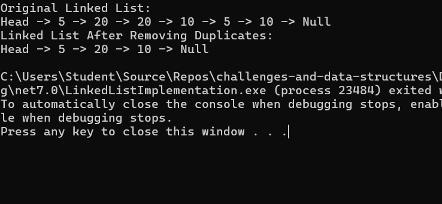

# Linked List Remove Duplicates

## Problem Domain

The task is to implement a method called `RemoveDuplicate()` in the existing linked list implementation. This method should remove all duplicate nodes from the linked list, ensuring that each value appears only once.

### Example

**Input:**  
`5 -> 20 -> 20 -> 10 -> 5 -> 10 -> Null`

**Output:**  
`5 -> 20 -> 10 -> Null`

## Requirements

- Continue working with the existing `Node` and `LinkedList` classes.
- Implement the `RemoveDuplicate()` method to remove duplicate nodes.
- The `RemoveDuplicate()` method should traverse the list, and for each node, it should check the rest of the list for duplicates. If a duplicate is found, it should be removed.
- Ensure the `PrintList()` method displays the list after removing duplicates.

## Input/Output

### Input

- A linked list with integer values, some of which may be duplicates.

### Output

- A linked list with all duplicates removed.

### Edge Cases

- **Empty List**: The method should handle the case where the linked list is empty.
- **No Duplicates**: The linked list should remain unchanged if there are no duplicates.
- **All Duplicates**: The linked list should be reduced to a single node if all nodes are duplicates.

## Algorithm

1. Initialize a pointer `current` to the head of the linked list.
2. Traverse the linked list with `current`.
3. For each node pointed to by `current`, initialize another pointer `index` to `current`.
4. Traverse the rest of the list with `index`, checking for duplicates.
5. If a duplicate is found, adjust the `Next` pointer of the node before the duplicate to skip over it.
6. Continue until all nodes have been checked.
7. The result is a linked list with no duplicate nodes.

## Visual Representation

**Before:**

Head -> 5 -> 20 -> 20 -> 10 -> 5 -> 10 -> Null

**After Removing Duplicates:**

Head -> 5 -> 20 -> 10 -> Null

## Big O Complexity

- **Time Complexity**: O(n^2) - where n is the number of nodes in the linked list. This is because for each node, we traverse the remaining nodes to check for duplicates.
- **Space Complexity**: O(1) - as no additional space is used beyond the original linked list.

## Console Output
