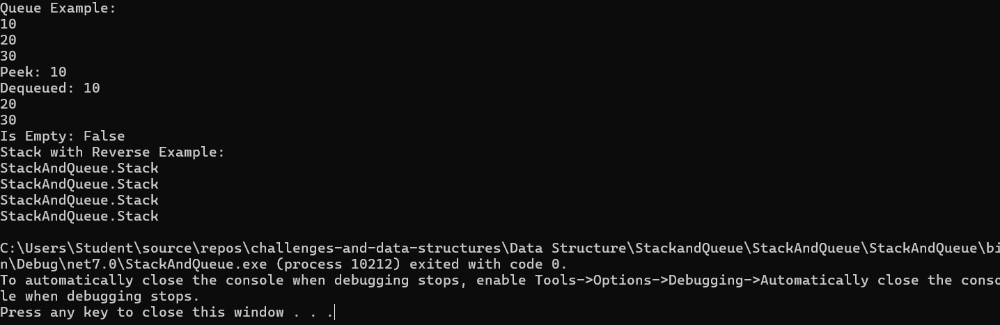
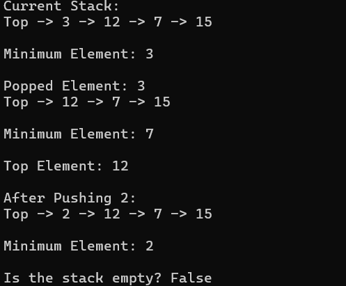

# Stack and Queue Implementation

## Problem Domain

The goal of this challenge is to implement basic stack and queue data structures in C#. A stack is a data structure that follows the Last-In-First-Out (LIFO) principle, while a queue follows the First-In-First-Out (FIFO) principle. Both data structures are fundamental in computer science and are used to solve various computational problems.

## Stack Implementation

### Stack Class

The `Stack` class supports the following methods:

- **Push(int data):** Adds a node with the specified data to the top of the stack.
- **Pop():** Removes and returns the top node from the stack.
- **Peek():** Returns the top node from the stack without removing it.
- **IsEmpty():** Checks if the stack is empty.
- **PrintStack():** Prints all elements in the stack to the console.

#### Example Usage

```csharp
Stack stack = new Stack();
stack.Push(10);
stack.Push(5);
stack.Push(20);
int peeked = stack.Peek(); // Should be 20
int popped = stack.Pop();  // Should be 20
bool isEmpty = stack.IsEmpty(); // Should be false
```

### Expected Output
Stack: Top -> 20 -> 5 -> 10 Peek: 20 Popped: 20 Stack: Top -> 5 -> 10 Is Empty: false


### Algorithm

**Push(int data):**
1. Create a new node.
2. Set the new node’s `Next` to the current top.
3. Update top to the new node.

**Pop():**
1. Check if the stack is empty.
2. Store the data of the current top node.
3. Update top to the next node.
4. Return the stored data.

**Peek():**
1. Check if the stack is empty.
2. Return the data of the current top node.

**IsEmpty():**
1. Return `true` if top is null, otherwise `false`.

### Real Code

```csharp
// Node class
public class Node
{
    public int Data { get; set; }
    public Node Next { get; set; }

    public Node(int data)
    {
        Data = data;
        Next = null;
    }
}

// Stack class
public class Stack
{
    private Node top;

    public Stack()
    {
        top = null;
    }

    public void Push(int data)
    {
        var newNode = new Node(data);
        newNode.Next = top;
        top = newNode;
    }

    public int Pop()
    {
        if (IsEmpty())
            throw new InvalidOperationException("Stack is empty.");

        int data = top.Data;
        top = top.Next;
        return data;
    }

    public int Peek()
    {
        if (IsEmpty())
            throw new InvalidOperationException("Stack is empty.");

        return top.Data;
    }

    public bool IsEmpty()
    {
        return top == null;
    }

    public void PrintStack()
    {
        var current = top;
        while (current != null)
        {
            Console.WriteLine(current.Data);
            current = current.Next;
        }
    }
}
```
## Big O Time/Space Complexity

### Stack
- **Push:** O(1)
- **Pop:** O(1)
- **Peek:** O(1)
- **IsEmpty:** O(1)
- **PrintStack:** O(n), where `n` is the number of elements in the stack

### Queue
- **Enqueue:** O(1)
- **Dequeue:** O(1)
- **Peek:** O(1)
- **IsEmpty:** O(1)
- **PrintQueue:** O(n), where `n` is the number of elements in the queue

## Visual Representation

### Stack
| 20 | | 5 | | 10 |


### Queue
Front -> [10] -> [20] -> [30] -> Rear


## Algorithm

### Enqueue(int data)
1. Create a new node.
2. If the queue is empty, set both `front` and `rear` to the new node.
3. Otherwise, set the `rear` node’s `Next` to the new node and update `rear` to the new node.

### Dequeue()
1. Check if the queue is empty.
2. Store the data of the `front` node.
3. Update `front` to the next node.
4. If `front` becomes null, set `rear` to null.
5. Return the stored data.

### Peek()
1. Check if the queue is empty.
2. Return the data of the `front` node.

### IsEmpty()
1. Return true if `front` is null, otherwise false.

## Real Code

### C# Queue Class

```csharp
// Queue class
public class Queue
{
    private Node front;
    private Node rear;

    public Queue()
    {
        front = null;
        rear = null;
    }

    public void Enqueue(int data)
    {
        var newNode = new Node(data);
        if (IsEmpty())
        {
            front = newNode;
            rear = newNode;
        }
        else
        {
            rear.Next = newNode;
            rear = newNode;
        }
    }

    public int Dequeue()
    {
        if (IsEmpty())
            throw new InvalidOperationException("Queue is empty.");

        int data = front.Data;
        front = front.Next;
        if (front == null)
            rear = null;
        return data;
    }

    public int Peek()
    {
        if (IsEmpty())
            throw new InvalidOperationException("Queue is empty.");

        return front.Data;
    }

    public bool IsEmpty()
    {
        return front == null;
    }

    public void PrintQueue()
    {
        var current = front;
        while (current != null)
        {
            Console.WriteLine(current.Data);
            current = current.Next;
        }
    }
}

```
## ScreenShot of output 


# Stack & Queue: Reverse a Stack using Queue

## Problem Domain

Implement a method to reverse a stack using a queue in C#. Extend the existing `Stack` class and add a `ReverseStack()` method that uses a queue to reverse the stack.

## Detailed Requirements

- **Class:** `StackWithReverse` extending the `Stack` class.
- **Method:** `ReverseStack()` to reverse stack elements using a queue.

## Example

```csharp
StackWithReverse stack = new StackWithReverse();
stack.Push(1);
stack.Push(2);
stack.Push(3);
stack.Push(4);
stack.Push(5);

Console.WriteLine(stack); // Stack: Top -> 5 -> 4 -> 3 -> 2 -> 1
stack.ReverseStack();
Console.WriteLine(stack); // Stack: Top -> 1 -> 2 -> 3 -> 4 -> 5

stack.Push(6);
stack.Push(7);
Console.WriteLine(stack); // Stack: Top -> 7 -> 6 -> 1 -> 2 -> 3 -> 4 -> 5
stack.ReverseStack();
Console.WriteLine(stack); // Stack: Top -> 5 -> 4 -> 3 -> 2 -> 1 -> 6 -> 7
```
## Inputs and Expected Outputs

### Multiple Elements:
- **Input:** 1, 2, 3, 4, 5
- **Output after reverse:** 1, 2, 3, 4, 5

### One Element:
- **Input:** 1
- **Output after reverse:** 1

### Empty Stack:
- **Input:** []
- **Output after reverse:** []

## Edge Cases
- Stack is empty.
- Stack contains only one element.

## Visual

### Stack (before reversal)
| 5 | | 4 | | 3 | | 2 | | 1 |

### Stack (after reversal)
| 1 | | 2 | | 3 | | 4 | | 5 |


## Algorithm
1. Pop elements from the stack one by one.
2. Enqueue each element into the queue.
3. Dequeue elements from the queue and push them back into the stack.
4. The stack is now reversed.

## Real Code

### Node Class
```csharp
// Node class
public class Node
{
    public int Data { get; set; }
    public Node Next { get; set; }

    public Node(int data)
    {
        Data = data;
        Next = null;
    }
}
```
### Stack Class
// Stack class
```
public class Stack
{
    private Node top;

    public Stack()
    {
        top = null;
    }

    public void Push(int data)
    {
        var newNode = new Node(data);
        newNode.Next = top;
        top = newNode;
    }

    public int Pop()
    {
        if (IsEmpty())
            throw new InvalidOperationException("Stack is empty.");

        int data = top.Data;
        top = top.Next;
        return data;
    }

    public int Peek()
    {
        if (IsEmpty())
            throw new InvalidOperationException("Stack is empty.");

        return top.Data;
    }

    public bool IsEmpty()
    {
        return top == null;
    }

    public override string ToString()
    {
        if (IsEmpty())
            return "Stack is empty.";

        var tempStack = new Stack<int>();
        var result = "Stack: Top -> ";

        while (!IsEmpty())
        {
            int data = Pop();
            tempStack.Push(data);
        }

        while (tempStack.Count > 0)
        {
            int data = tempStack.Pop();
            result += data + " -> ";
            Push(data); // Restore to original stack
        }

        return result.TrimEnd(' ', '-') + " (End)";
    }
}
```
### Queue Class
```
// Queue class
public class Queue
{
    private Node front;
    private Node rear;

    public Queue()
    {
        front = null;
        rear = null;
    }

    public void Enqueue(int data)
    {
        var newNode = new Node(data);
        if (IsEmpty())
        {
            front = newNode;
            rear = newNode;
        }
        else
        {
            rear.Next = newNode;
            rear = newNode;
        }
    }

    public int Dequeue()
    {
        if (IsEmpty())
            throw new InvalidOperationException("Queue is empty.");

        int data = front.Data;
        front = front.Next;
        if (front == null)
            rear = null;
        return data;
    }

    public int Peek()
    {
        if (IsEmpty())
            throw new InvalidOperationException("Queue is empty.");

        return front.Data;
    }

    public bool IsEmpty()
    {
        return front == null;
    }

    public void PrintQueue()
    {
        var current = front;
        while (current != null)
        {
            Console.WriteLine(current.Data);
            current = current.Next;
        }
    }
}

```
### StackWithReverse Class
```
// StackWithReverse class
public class StackWithReverse : Stack
{
    private Queue<int> queue;

    public StackWithReverse() : base()
    {
        queue = new Queue<int>();
    }

    public void ReverseStack()
    {
        if (IsEmpty())
        {
            Console.WriteLine("Stack is empty. Nothing to reverse.");
            return;
        }

        while (!IsEmpty())
        {
            int data = Pop();
            queue.Enqueue(data);
        }

        while (queue.Count > 0)
        {
            int data = queue.Dequeue();
            Push(data);
        }
    }

    public override string ToString()
    {
        if (IsEmpty())
            return "Stack is empty.";

        var tempStack = new Stack<int>();
        var result = "Stack: Top -> ";

        while (!IsEmpty())
        {
            int data = Pop();
            tempStack.Push(data);
        }

        while (tempStack.Count > 0)
        {
            int data = tempStack.Pop();
            result += data + " -> ";
            Push(data);
        }

        return result.TrimEnd(' ', '-') + " (End)";
    }
}
```

## Screenshot of output 


# Stack Challenge: Delete Middle Element of a Stack

## Problem Domain

This challenge involves implementing a method to delete the middle element of a stack in C#. If the stack has an even number of elements, the lower middle element should be removed.

## Detailed Requirements

1. **Class to Implement:** `StackWithDeleteMiddle`
2. **Method to Implement:** `DeleteMiddle()`
   - Removes the middle element of the stack.
   - Utilizes an additional stack or other methods to achieve the result.
   - Ensures the stack remains in the correct order after the middle element is removed.
   - Handles edge cases where the stack is empty or has only one element.

## Example

```csharp
StackWithDeleteMiddle stack = new StackWithDeleteMiddle();
stack.Push(7);
stack.Push(14);
stack.Push(3);
stack.Push(8);
stack.Push(5);

Console.WriteLine(stack); // Stack: Top -> 5 -> 8 -> 3 -> 14 -> 7
stack.DeleteMiddle();
Console.WriteLine(stack); // Stack: Top -> 5 -> 8 -> 14 -> 7

stack.Push(2);
stack.Push(9);
stack.Push(11);
Console.WriteLine(stack); // Stack: Top -> 11 -> 9 -> 2 -> 5 -> 8 -> 14 -> 7
stack.DeleteMiddle();
Console.WriteLine(stack); // Stack: Top -> 11 -> 9 -> 2 -> 8 -> 14 -> 7
```
# Delete Middle Element of a Stack

## Overview

The `StackWithDeleteMiddle` class extends the functionality of a standard stack to include the ability to delete the middle element. This implementation is based on a custom stack class that inherits from `System.Collections.Generic.Stack<int>`.

## Implementation

### `StackWithDeleteMiddle.cs`

```csharp
using System;
using System.Collections.Generic;
using System.Linq;

namespace StackAndQueue.StackAndQueue
{
    public class StackWithDeleteMiddle : Stack<int>
    {
        public void DeleteMiddle()
        {
            if (Count == 0) return; // Handle empty stack
            int middleIndex = (Count - 1) / 2;
            Stack<int> tempStack = new Stack<int>();
            int currentIndex = 0;

            // Pop elements to find the middle element and temporarily store them
            while (Count > 0)
            {
                int value = Pop();
                if (currentIndex != middleIndex)
                {
                    tempStack.Push(value);
                }
                currentIndex++;
            }

            // Push the elements back except the middle one
            while (tempStack.Count > 0)
            {
                Push(tempStack.Pop());
            }
        }

        public override string ToString()
        {
            return "Stack: " + string.Join(" -> ", this.Reverse());
        }
    }
}

```

## Edge Cases

- **Empty Stack:** No element to delete.
- **Single Element:** Removing the only element should result in an empty stack.
- **Even Number of Elements:** Remove the lower middle element.

## Algorithm

1. **Calculate Middle Position:** Determine the middle index based on the total count of elements in the stack.
2. **Use Temporary Stack:** Pop elements from the original stack while skipping the middle element.
3. **Restore Elements:** Push the elements back onto the original stack, ensuring the order is preserved.

## Time and Space Complexity

- **Time Complexity:** O(n), where n is the number of elements in the stack. Each element is pushed and popped once.
- **Space Complexity:** O(n), due to the use of an additional stack to temporarily hold elements.

## Console Output

Below is a screenshot of the console output demonstrating the stack operations:


## Additional Information

- Ensure that all exceptions and edge cases are handled appropriately.
- Add unit tests to verify the correctness of the `DeleteMiddle()` method.

## Instructions for Usage

1. **Create a Branch:** Ensure you are working on a branch named `Delete-Middle-Element-Stack`.
2. **Add Files:** Place `StackWithDeleteMiddle.cs` and this `README.md` in the `DeleteMiddleElement` folder.
3. **Update Table of Contents:** Include a link to this README file in the Table of Contents of the root `README.md`.

## Implementation

The implementation of the `DeleteMiddle` method can be found in the `StackWithDeleteMiddle.cs` file within the `DeleteMiddleElement` folder. This method handles the core functionality of removing the middle element from the stack.

## ScreenShot of output

- Pop()
- Top()
- IsEmpty()
- GetMin()
- PrintStack()

## Inputs and Expected Outputs
| Operation | Input  | Output  |
| --------- | ------ | ------- |
| Push      | 15, 7  | -       |
| GetMin    | -      | 7       |
| Pop       | -      | 3       |
| Top       | -      | 12      |
| IsEmpty   | -      | False   |

## Edge Cases
- Popping from an empty stack should throw an exception.
- Getting the minimum from an empty stack should throw an exception.

## Visual Representation

Initial Stack: Top -> 3 -> 12 -> 7 -> 15 (min: 3)

After Pop(): Top -> 12 -> 7 -> 15 (min: 7)

After Push(2): Top -> 2 -> 12 -> 7 -> 15 (min: 2)


## Algorithm
1. Initialize two stacks: `mainStack` for storing elements, and `minStack` for storing the minimum elements.
2. On `Push(x)`, push `x` onto `mainStack`. If `minStack` is empty or `x` is less than or equal to the top of `minStack`, push `x` onto `minStack`.
3. On `Pop()`, pop the top element from `mainStack`. If the popped element is the same as the top of `minStack`, pop the top element from `minStack`.
4. On `GetMin()`, return the top element of `minStack`.
5. On `Top()`, return the top element of `mainStack`.
6. On `IsEmpty()`, return whether `mainStack` is empty.

## Big O Time/Space Complexity
- **Time Complexity:** O(1) for all operations.
- **Space Complexity:** O(n), where `n` is the number of elements in the stack.

## Console Output
