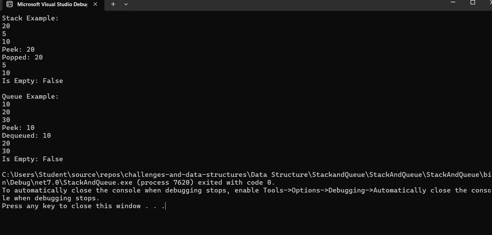

# Stack and Queue Implementation

## Problem Domain

The goal of this challenge is to implement basic stack and queue data structures in C#. A stack is a data structure that follows the Last-In-First-Out (LIFO) principle, while a queue follows the First-In-First-Out (FIFO) principle. Both data structures are fundamental in computer science and are used to solve various computational problems.

## Stack Implementation

### Stack Class

The `Stack` class supports the following methods:

- **Push(int data):** Adds a node with the specified data to the top of the stack.
- **Pop():** Removes and returns the top node from the stack.
- **Peek():** Returns the top node from the stack without removing it.
- **IsEmpty():** Checks if the stack is empty.
- **PrintStack():** Prints all elements in the stack to the console.

#### Example Usage

```csharp
Stack stack = new Stack();
stack.Push(10);
stack.Push(5);
stack.Push(20);
int peeked = stack.Peek(); // Should be 20
int popped = stack.Pop();  // Should be 20
bool isEmpty = stack.IsEmpty(); // Should be false
```

### Expected Output
Stack: Top -> 20 -> 5 -> 10 Peek: 20 Popped: 20 Stack: Top -> 5 -> 10 Is Empty: false


### Algorithm

**Push(int data):**
1. Create a new node.
2. Set the new node’s `Next` to the current top.
3. Update top to the new node.

**Pop():**
1. Check if the stack is empty.
2. Store the data of the current top node.
3. Update top to the next node.
4. Return the stored data.

**Peek():**
1. Check if the stack is empty.
2. Return the data of the current top node.

**IsEmpty():**
1. Return `true` if top is null, otherwise `false`.

### Real Code

```csharp
// Node class
public class Node
{
    public int Data { get; set; }
    public Node Next { get; set; }

    public Node(int data)
    {
        Data = data;
        Next = null;
    }
}

// Stack class
public class Stack
{
    private Node top;

    public Stack()
    {
        top = null;
    }

    public void Push(int data)
    {
        var newNode = new Node(data);
        newNode.Next = top;
        top = newNode;
    }

    public int Pop()
    {
        if (IsEmpty())
            throw new InvalidOperationException("Stack is empty.");

        int data = top.Data;
        top = top.Next;
        return data;
    }

    public int Peek()
    {
        if (IsEmpty())
            throw new InvalidOperationException("Stack is empty.");

        return top.Data;
    }

    public bool IsEmpty()
    {
        return top == null;
    }

    public void PrintStack()
    {
        var current = top;
        while (current != null)
        {
            Console.WriteLine(current.Data);
            current = current.Next;
        }
    }
}
```
## Big O Time/Space Complexity

### Stack
- **Push:** O(1)
- **Pop:** O(1)
- **Peek:** O(1)
- **IsEmpty:** O(1)
- **PrintStack:** O(n), where `n` is the number of elements in the stack

### Queue
- **Enqueue:** O(1)
- **Dequeue:** O(1)
- **Peek:** O(1)
- **IsEmpty:** O(1)
- **PrintQueue:** O(n), where `n` is the number of elements in the queue

## Visual Representation

### Stack
| 20 | | 5 | | 10 |


### Queue
Front -> [10] -> [20] -> [30] -> Rear


## Algorithm

### Enqueue(int data)
1. Create a new node.
2. If the queue is empty, set both `front` and `rear` to the new node.
3. Otherwise, set the `rear` node’s `Next` to the new node and update `rear` to the new node.

### Dequeue()
1. Check if the queue is empty.
2. Store the data of the `front` node.
3. Update `front` to the next node.
4. If `front` becomes null, set `rear` to null.
5. Return the stored data.

### Peek()
1. Check if the queue is empty.
2. Return the data of the `front` node.

### IsEmpty()
1. Return true if `front` is null, otherwise false.

## Real Code

### C# Queue Class

```csharp
// Queue class
public class Queue
{
    private Node front;
    private Node rear;

    public Queue()
    {
        front = null;
        rear = null;
    }

    public void Enqueue(int data)
    {
        var newNode = new Node(data);
        if (IsEmpty())
        {
            front = newNode;
            rear = newNode;
        }
        else
        {
            rear.Next = newNode;
            rear = newNode;
        }
    }

    public int Dequeue()
    {
        if (IsEmpty())
            throw new InvalidOperationException("Queue is empty.");

        int data = front.Data;
        front = front.Next;
        if (front == null)
            rear = null;
        return data;
    }

    public int Peek()
    {
        if (IsEmpty())
            throw new InvalidOperationException("Queue is empty.");

        return front.Data;
    }

    public bool IsEmpty()
    {
        return front == null;
    }

    public void PrintQueue()
    {
        var current = front;
        while (current != null)
        {
            Console.WriteLine(current.Data);
            current = current.Next;
        }
    }
}

```
## ScreenShot of output 
