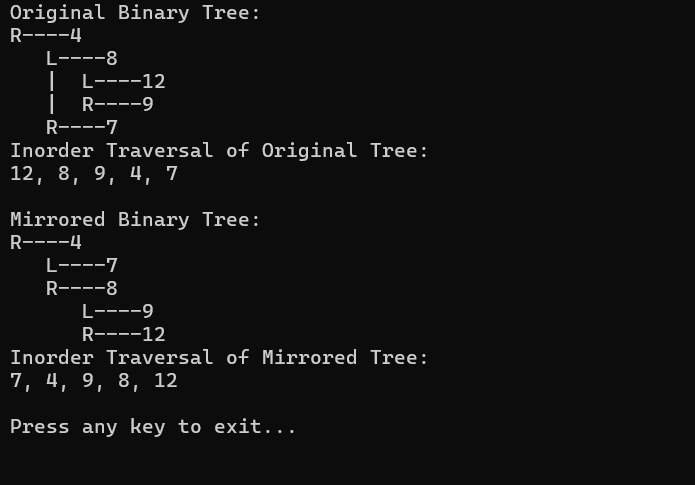
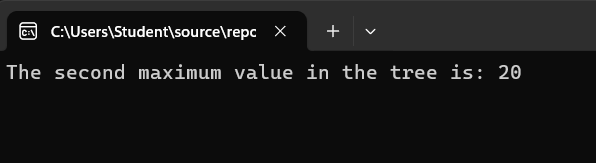

# Binary Tree and Binary Search Tree Implementation

## Problem Domain

Implement a binary tree and binary search tree data structures in C#.

### Binary Tree Implementation

- **BinaryTree Class**:
  - `PreOrder()`: Traverse the tree in pre-order (Root, Left, Right).
  - `InOrder()`: Traverse the tree in in-order (Left, Root, Right).
  - `PostOrder()`: Traverse the tree in post-order (Left, Right, Root).
  - `Print()`: Display the tree in the console in a structured way.

### Binary Search Tree (BST) Implementation

- **BinarySearchTree Class**:
  - `Add(int data)`: Add a node with the specified data in the correct location to maintain BST properties.
  - `Contains(int data)`: Return whether a node with the specified data exists in the tree.
  - `Remove(int data)`: Remove the node with the specified data while maintaining BST properties.

## Inputs and Expected Outputs

### Binary Tree

| Method    | Input           | Expected Output                      |
|-----------|-----------------|--------------------------------------|
| `PreOrder`| Tree: [1, 2, 3, 4, 5] | 1 2 4 5 3 |
| `InOrder` | Tree: [1, 2, 3, 4, 5] | 4 2 5 1 3 |
| `PostOrder`| Tree: [1, 2, 3, 4, 5] | 4 5 2 3 1 |
| `Print`   | Tree: [1, 2, 3, 4, 5] | Prints tree structure |

### Binary Search Tree (BST)

| Method    | Input                | Expected Output                          |
|-----------|----------------------|------------------------------------------|
| `Add`     | 10, 5, 15, 7         | BST with nodes 10, 5, 15, 7              |
| `Contains`| 7                    | True                                     |
| `Contains`| 3                    | False                                    |
| `Remove`  | 5                    | BST without node 5                       |
| `Print`   | [10, 5, 15, 7, 12, 20]| Prints tree structure                    |

## Edge Cases

- **Empty Tree**: Ensure methods handle cases where the tree is empty.
- **Single Node**: Handle trees with only a single node.
- **Non-Existent Node**: For `Contains` and `Remove`, ensure the tree handles non-existent nodes gracefully.
- **Unbalanced Tree**: Ensure the tree operations work correctly even if the tree is unbalanced.

## Visual

### Binary Tree Example:

1
/
2 3 /
4 5

### Binary Search Tree Example:
10
/
5 15 \ /
7 12 20

## Algorithm

### BinaryTree

- **PreOrder**: Visit Root -> Traverse Left Subtree -> Traverse Right Subtree.
- **InOrder**: Traverse Left Subtree -> Visit Root -> Traverse Right Subtree.
- **PostOrder**: Traverse Left Subtree -> Traverse Right Subtree -> Visit Root.
- **Print**: Recursively print the tree in a structured way.

### BinarySearchTree

- **Add**: Recursively traverse the tree and place the new node in the correct position.
- **Contains**: Recursively search the tree to find the node with the specified value.
- **Remove**: Recursively find the node to remove, handle different cases (leaf node, single child, two children), and adjust the tree structure.

## Big O Time/Space Complexity

### BinaryTree

* **PreOrder, InOrder, PostOrder Traversals**: O(n) time, O(h) space where h is the height of the tree.
* **Print**: O(n) time, O(h) space.

### BinarySearchTree

* **Add, Contains, Remove**: Average case O(log n) time, O(1) space. Worst case (unbalanced tree) O(n) time, O(1) space.

## Console Output Screenshot


# Binary Tree - Mirror Tree

## Problem Domain

Convert a binary tree into its mirror tree. The mirror tree of a binary tree is a tree that looks exactly like the original binary tree but with all the left and right children swapped at every node.

## Challenge Description

Implement a method to convert the Binary Tree into its mirror tree. This involves:
- Swapping the left and right subtrees at every node.
- Performing an inorder traversal to demonstrate the transformation.

## Methods

### MirrorTree()

- Converts the Binary Tree into its mirror tree.
- Recursively swap the left and right subtrees.

### InorderTraversal()

- Returns a list of nodes in inorder sequence.

## Example


**Original Binary Tree:**

4 /
8 7 / 12 9


**Mirrored Binary Tree:**

4 /
7 8 /
9 12


## Instructions

1. **Create a new branch** called `Mirror-Tree` inside your `Data Structures` directory.
2. **Create a folder** named `MirrorTree` inside `Data Structures`.
3. **Implement** the `MirrorTree` functionality in your `BinaryTree` class.
4. **Add a `README.md` file** with the following content inside the `MirrorTree` folder.
5. **Include a screenshot** of your console output in the `README.md` file.
6. **Update the Table of Contents** in the root `README.md` of your repository with a link to this challenge's `README.md` file.

## Console Output Example

```csharp
BinaryTree Btree = new BinaryTree();
Btree.Root = new Node(4);
Btree.Root.Left = new Node(8);
Btree.Root.Right = new Node(7);
Btree.Root.Left.Left = new Node(12);
Btree.Root.Left.Right = new Node(9);

List<int> originalInorder = Btree.InorderTraversal(); // Output: [12, 8, 9, 4, 7]

      4
     / \
    8   7
   / \
 12   9

Btree.Mirror();

      4
     / \
    7   8
       / \
      9  12

List<int> mirroredInorder = Btree.InorderTraversal(); // Output: [7, 4, 9, 8, 12]
```
## Edge Cases

1. **Empty Tree**
   - Ensure that the method handles the case where the tree is empty.

2. **Single-Node Tree**
   - Verify the method works with a tree containing only one node.

3. **Complex Trees**
   - Test with trees of varying structures to ensure all nodes are mirrored correctly.

## Visual

### Original Binary Tree:
  4
 / \
8   7
/
12 9
### Mirrored Binary Tree:

  4
 / \
7   8
   / \
  9  12

  
## Algorithm

### MirrorTree()
1. Traverse the tree recursively.
2. Swap the left and right children of each node.
3. Continue until all nodes have been processed.

### InorderTraversal()
1. Traverse the left subtree.
2. Visit the root.
3. Traverse the right subtree.
4. Collect node values in a list.

## Big O Time/Space Complexity

- **Time Complexity:** O(n), where `n` is the number of nodes in the tree. Each node is visited once.
- **Space Complexity:** O(h), where `h` is the height of the tree. This is due to the recursion stack space.

## ScreenShot


# Binary Tree - Second Maximum Value

## Problem Domain

The task is to find the second maximum value in a binary tree. The second maximum value is the largest value among the nodes that are less than the maximum value in the tree.

## Challenge Description

Given a binary tree, write a method `FindSecondMax()` that traverses the tree to find the second maximum value. The solution should handle edge cases such as:
- An empty tree.
- A tree with only one node.
- A tree with fewer than two unique values.

### Example

Given the following binary tree:
  10
 /  \
5    20
/ \ /
3 7 15 25

The second maximum value is `20`.

## Inputs and Expected Outputs

| Input | Output |
|-------|--------|
| Tree with values `[10, 5, 20, 3, 7, 15, 25]` | `20` |
| Empty Tree | Exception: "Tree must have at least two nodes." |
| Tree with one value `[10]` | Exception: "Tree must have at least two nodes." |
| Tree with all identical values `[10, 10, 10]` | Exception: "Tree must have at least two unique values." |

## Edge Cases

- **Empty Tree**: The method should throw an exception indicating that the tree must contain at least two nodes.
- **Single Node**: The method should throw an exception indicating that the tree must contain at least two nodes.
- **Duplicate Values**: The method should throw an exception if the tree does not contain at least two unique values.

## Visual Representation

Here’s a visual representation of the binary tree:

10
 /  \
5    20
/ \ /
3 7 15 25
In this tree:
- The maximum value is `25`.
- The second maximum value is `20`.

## Algorithm

1. Initialize `max` and `secondMax` to `int.MinValue`.
2. Traverse the tree recursively:
    - If the current node's value is greater than `max`, update `secondMax` to `max` and `max` to the current node's value.
    - If the current node's value is less than `max` but greater than `secondMax`, update `secondMax`.
3. After the traversal, if `secondMax` is still `int.MinValue`, throw an exception indicating there aren't enough unique values in the tree.
4. Return `secondMax`.

## Real Code

Here’s the implementation of the `FindSecondMax()` method:

```csharp
public int FindSecondMax()
{
    if (Root == null || (Root.Left == null && Root.Right == null))
        throw new InvalidOperationException("Tree must have at least two nodes.");

    int max = int.MinValue;
    int secondMax = int.MinValue;

    void Traverse(Node node)
    {
        if (node == null) return;

        if (node.Data > max)
        {
            secondMax = max;
            max = node.Data;
        }
        else if (node.Data > secondMax && node.Data < max)
        {
            secondMax = node.Data;
        }

        Traverse(node.Left);
        Traverse(node.Right);
    }

    Traverse(Root);

    if (secondMax == int.MinValue)
        throw new InvalidOperationException("Tree must have at least two unique values.");

    return secondMax;
}
```

## Big O Time/Space Complexity

- **Time Complexity**: `O(n)`, where `n` is the number of nodes in the tree. The method needs to visit each node to determine the second maximum value.

- **Space Complexity**: `O(h)`, where `h` is the height of the tree. The space complexity is mainly due to the recursive stack space used during the tree traversal.

