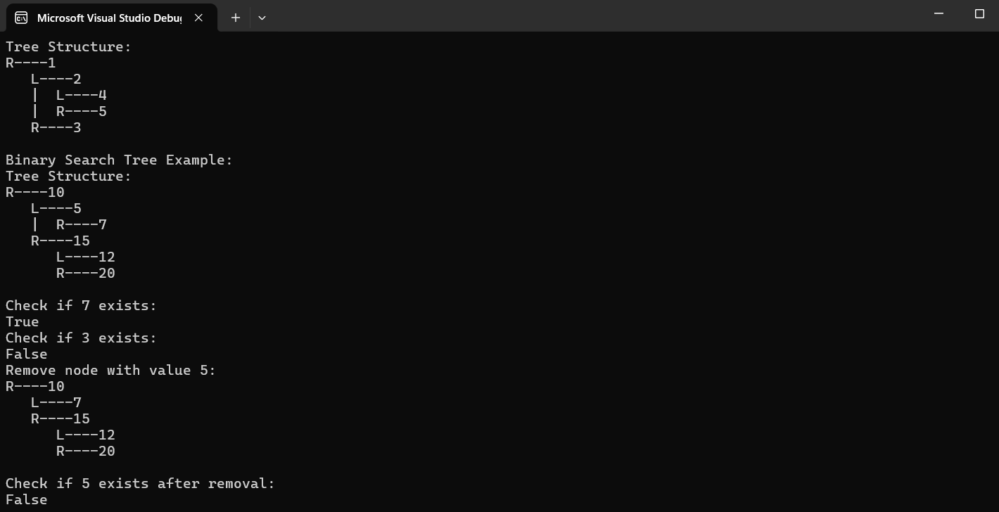

# Binary Tree and Binary Search Tree Implementation

## Problem Domain

Implement a binary tree and binary search tree data structures in C#.

### Binary Tree Implementation

- **BinaryTree Class**:
  - `PreOrder()`: Traverse the tree in pre-order (Root, Left, Right).
  - `InOrder()`: Traverse the tree in in-order (Left, Root, Right).
  - `PostOrder()`: Traverse the tree in post-order (Left, Right, Root).
  - `Print()`: Display the tree in the console in a structured way.

### Binary Search Tree (BST) Implementation

- **BinarySearchTree Class**:
  - `Add(int data)`: Add a node with the specified data in the correct location to maintain BST properties.
  - `Contains(int data)`: Return whether a node with the specified data exists in the tree.
  - `Remove(int data)`: Remove the node with the specified data while maintaining BST properties.

## Inputs and Expected Outputs

### Binary Tree

| Method    | Input           | Expected Output                      |
|-----------|-----------------|--------------------------------------|
| `PreOrder`| Tree: [1, 2, 3, 4, 5] | 1 2 4 5 3 |
| `InOrder` | Tree: [1, 2, 3, 4, 5] | 4 2 5 1 3 |
| `PostOrder`| Tree: [1, 2, 3, 4, 5] | 4 5 2 3 1 |
| `Print`   | Tree: [1, 2, 3, 4, 5] | Prints tree structure |

### Binary Search Tree (BST)

| Method    | Input                | Expected Output                          |
|-----------|----------------------|------------------------------------------|
| `Add`     | 10, 5, 15, 7         | BST with nodes 10, 5, 15, 7              |
| `Contains`| 7                    | True                                     |
| `Contains`| 3                    | False                                    |
| `Remove`  | 5                    | BST without node 5                       |
| `Print`   | [10, 5, 15, 7, 12, 20]| Prints tree structure                    |

## Edge Cases

- **Empty Tree**: Ensure methods handle cases where the tree is empty.
- **Single Node**: Handle trees with only a single node.
- **Non-Existent Node**: For `Contains` and `Remove`, ensure the tree handles non-existent nodes gracefully.
- **Unbalanced Tree**: Ensure the tree operations work correctly even if the tree is unbalanced.

## Visual

### Binary Tree Example:

1
/
2 3 /
4 5

### Binary Search Tree Example:
10
/
5 15 \ /
7 12 20

## Algorithm

### BinaryTree

- **PreOrder**: Visit Root -> Traverse Left Subtree -> Traverse Right Subtree.
- **InOrder**: Traverse Left Subtree -> Visit Root -> Traverse Right Subtree.
- **PostOrder**: Traverse Left Subtree -> Traverse Right Subtree -> Visit Root.
- **Print**: Recursively print the tree in a structured way.

### BinarySearchTree

- **Add**: Recursively traverse the tree and place the new node in the correct position.
- **Contains**: Recursively search the tree to find the node with the specified value.
- **Remove**: Recursively find the node to remove, handle different cases (leaf node, single child, two children), and adjust the tree structure.

## Big O Time/Space Complexity

### BinaryTree

* **PreOrder, InOrder, PostOrder Traversals**: O(n) time, O(h) space where h is the height of the tree.
* **Print**: O(n) time, O(h) space.

### BinarySearchTree

* **Add, Contains, Remove**: Average case O(log n) time, O(1) space. Worst case (unbalanced tree) O(n) time, O(1) space.

## Console Output Screenshot

