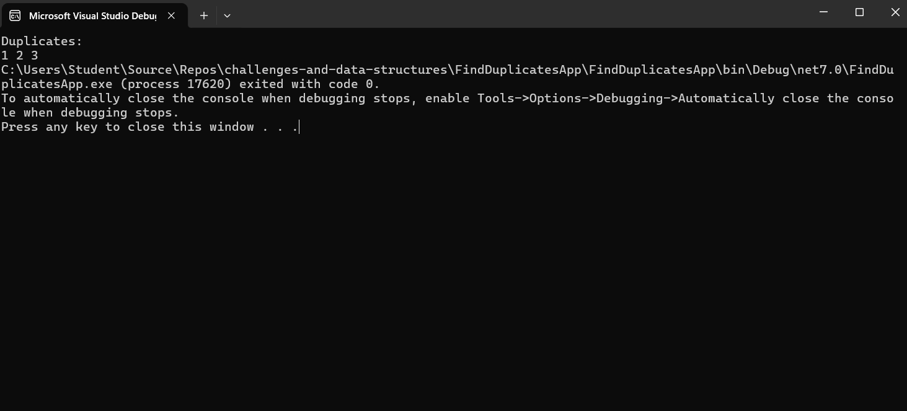

# Challenge 05: Find Duplicates in Array

## Problem Domain
Write a function called `FindDuplicates` that accepts an array as its parameter. Without utilizing any of the built-in methods provided by the language, the function should return an array of duplicate values.

## Example
- Input: `[1, 2, 3, 1, 2, 3]`
  Output: `[1, 2, 3]`

- Input: `[16, 8, 31, 17, 15, 23, 17, 8]`
  Output: `[17, 8]`

- Input: `[5, 10, 16, 20, 10, 16]`
  Output: `[10, 16]`

## Implementation and Testing
Ensure that each method you write is clean and well-organized. Your code should be modular.

## Console Output

## Big O Time/Space Complexity
- Time Complexity: O(n)
- Space Complexity: O(n)
