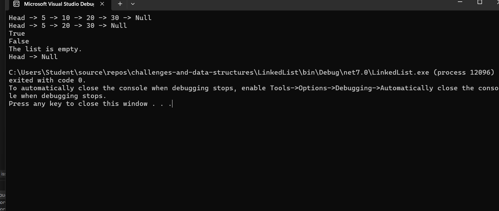

# Linked List Implementation

## Problem Domain
Implement a basic singly linked list data structure in C#.

## Inputs and Expected Outputs
- Inputs: Sequence of integers.
- Outputs: Printed linked list, search results, modified list after removal.

## Edge Cases
- Removing a node from an empty list.
- Searching for a non-existent node.
- Adding nodes to an empty list.

## Visual
Head -> 5 -> 10 -> 20 -> 30 -> Null
After removing 10:
Head -> 5 -> 20 -> 30 -> Null

## Algorithm
1. Define Node class with data and next properties.
2. Define LinkedList class with head property.
3. Implement methods to add nodes, remove nodes, and print the list.

## Real Code
Included in the files.

## Big O Time/Space Complexity
- Insertion: O(n)
- Deletion: O(n)
- Search: O(n)

## Console Output Screenshot

Done
